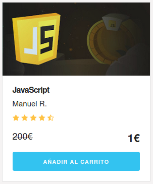
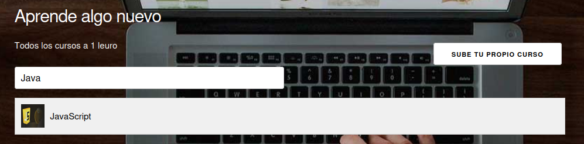
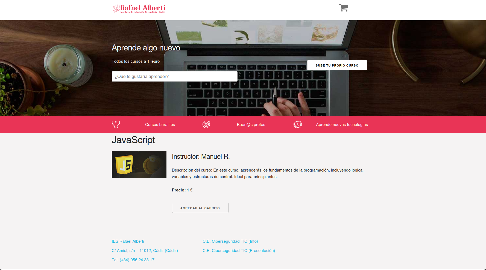
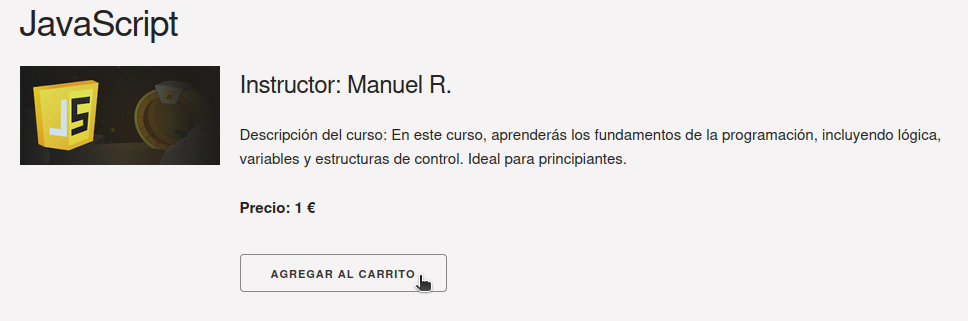
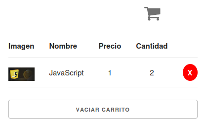

# Sistema de Catálogo y Gestión de Carrito de Cursos

Este proyecto, titulado  **Sistema de Catálogo y Gestión de Carrito de Cursos** , constituye una aplicación web avanzada que permite a los usuarios explorar, buscar y añadir cursos a un carrito de compra persistente. La persistencia de datos se implementa mediante  **IndexedDB** , lo que garantiza que tanto el catálogo de cursos como los elementos del carrito y los cursos personalizados permanezcan almacenados de manera duradera. Las funcionalidades incluyen una barra de búsqueda dinámica, visualización detallada de cursos y un sistema de carrito con opciones para añadir, actualizar y eliminar cursos.

## Funcionalidades Principales

### 1. Base de Datos Persistente con IndexedDB

* La aplicación configura una base de datos denominada **Cursos** utilizando IndexedDB, permitiendo el almacenamiento de datos de los cursos y del carrito de compra.
* Los datos de usuario se conservan entre sesiones, permitiendo una experiencia de uso consistente sin pérdidas de información al actualizar la página.
* IndexedDB soporta la persistencia de información detallada de cada curso, incluyendo campos como ID, nombre, precio, imagen y detalles sobre el instructor.
* Además, se registra información de contacto (correo electrónico) en la base de datos para fines administrativos y de soporte.

### 2. Barra de Búsqueda con Autocompletado

* La aplicación incorpora una barra de búsqueda optimizada que facilita al usuario encontrar cursos por nombre de manera rápida y eficiente.
* Mientras el usuario escribe en la barra de búsqueda, un menú desplegable sugiere cursos que coinciden con la consulta.
* Al seleccionar un curso desde los resultados de búsqueda, el usuario es redirigido a la página de detalles correspondiente, mejorando significativamente la navegabilidad y accesibilidad de la información.

### 3. Inclusión de Cursos Personalizados con Validación Rigurosa

* Los usuarios tienen la opción de añadir cursos personalizados al catálogo mediante un formulario.
* Este formulario incluye validaciones avanzadas para campos como el nombre del curso y el instructor, asegurando unicidad y consistencia en la base de datos.
* Los cursos personalizados se almacenan en IndexedDB, lo que permite que sean accesibles tanto en el catálogo general como en futuras búsquedas, ampliando la flexibilidad y personalización del sistema.

## Instrucciones de Uso

### 1. Visualización de Detalles del Curso

* Navegar a la página de detalles de un curso es sencillo: basta con seleccionar el curso deseado desde las imágenes en la interfaz de catálogo o utilizar la barra de búsqueda.

  
* La página de detalles proporciona información completa del curso, incluyendo el nombre, el instructor, el precio y la imagen correspondiente.

  

### 2. Gestión de Carrito de Compra

* Desde la página de detalles de un curso, el usuario puede agregar el curso al carrito mediante un botón designado  **Agregar al Carrito** .

  
* En caso de que el curso ya esté en el carrito, la cantidad se incrementará en lugar de duplicar la entrada.

  

* En la vista de carrito, cada curso aparece con su imagen, nombre, precio, cantidad y una opción para eliminarlo si es necesario, brindando un control completo sobre el contenido del carrito.

### 3. Utilización de la Barra de Búsqueda

* Al escribir en la barra de búsqueda, el usuario recibe resultados de coincidencias en un menú desplegable, que muestra la imagen y el nombre de cada curso.
* La selección de un curso en estos resultados dirige al usuario a su página de detalles específica, optimizando la navegación y acceso a la información.

### 4. Adición de Cursos Personalizados

* En la página  **Agregar Curso** , el usuario puede completar los detalles del curso, incluyendo el nombre del curso, el instructor y el correo electrónico.
* El precio está predefinido en 1 euro, acorde a una promoción que se aplica a todos los cursos originales.
* Una vez validada la información, el curso se añade al catálogo general y estará disponible tanto en la búsqueda como en el carrito de compra.

## Estructura del Proyecto

* **index.html** : Página de inicio que muestra el catálogo de cursos.
* **course-details.html** : Página que ofrece una vista detallada de cada curso.
* **add-course.html** : Página de formulario para añadir nuevos cursos personalizados al catálogo.

## Justificación de las Implementaciones Clave

1. **Barra de Búsqueda con Autocompletado** :

* **Justificación** : Proveer una barra de búsqueda con autocompletado ofrece una experiencia de usuario más ágil y personalizada, permitiendo una localización rápida de cursos específicos, especialmente a medida que el catálogo de cursos aumenta en tamaño.

1. **Base de Datos Persistente con IndexedDB** :

* **Justificación** : La utilización de IndexedDB para la persistencia de datos asegura que el catálogo y el carrito conserven su contenido entre sesiones, emulando una experiencia de usuario fluida y realista en la que los datos no se pierden al refrescar la página. La elección de IndexedDB, en este caso, proporciona una capa de almacenamiento avanzada que es particularmente útil para aplicaciones web de mediana a gran escala.

1. **Añadir Cursos Personalizados con Validación de Campos** :

* **Justificación** : La posibilidad de que los usuarios personalicen el catálogo de cursos fomenta la interacción y brinda una experiencia de uso avanzada. La validación rigurosa garantiza la calidad de los datos y previene entradas no válidas, manteniendo así la integridad de la base de datos y la confiabilidad de la aplicación en su conjunto.

## Ejemplos Prácticos de Uso

### Añadir un Curso Personalizado:

1. Acceder a  **add-course.html** .
2. Completar los campos con los siguientes datos de ejemplo:
   * **Nombre del Curso** : "Introducción a IndexedDB"
   * **Instructor** : "Pablo Barrera"
   * **Precio** : 1 (automáticamente definido en la base de datos)
3. Enviar el formulario. El curso nuevo aparecerá en el catálogo y estará disponible en la barra de búsqueda para futuras consultas.

---

### Ejemplo de Búsqueda:

1. En  **index.html** , empezar a escribir en la barra de búsqueda.
2. Ingresar un término como: "Java".
3. Revisar los resultados en el menú desplegable y seleccionar uno, por ejemplo, "JavaScript".
4. Serás redirigido a la página de detalles del curso, donde podrás consultar la información completa sobre el mismo, incluyendo nombre, instructor y precio.
